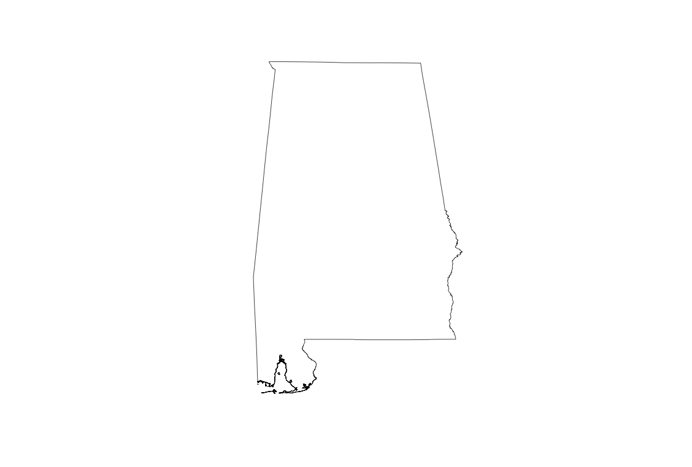

# Try the following at the R Console

### Examine the class of the fileData

class(fileData)

```
[1] "SpatialPolygonsDataFrame"
attr(,"package")
[1] "sp"
```

This object is a SpatialPolygonsDataFrame.  The other types of spatial data frames are: SpatialPointsDataFrame, SpatialMultiPointsDataFrame, SpatialPixelsDataFrame, SpatialGridDataFrame and SpatialLinesDataFrame

### Examine the slot names in filData

slotNames(fileData)

```
[1] "data"        "polygons"    "plotOrder"   "bbox"        "proj4string"
```

See the formal definitions of the slots at http://www.inside-r.org/packages/cran/sp/docs/as.data.frame.SpatialPolygons

### Examine the names in fileData

names(fileData)

```
[1] "ID_0"      "ISO"       "NAME_0"    "ID_1"      "NAME_1"    "TYPE_1"    "ENGTYPE_1" "NL_NAME_1" "VARNAME_1"
```

These are the column names of the attributes.

### Examine the fileAttributes variable

str(fileAttributes)

```
'data.frame':	52 obs. of  9 variables:
 $ ID_0     : int  244 244 244 244 244 244 244 244 244 244 ...
 $ ISO      : Factor w/ 1 level "USA": 1 1 1 1 1 1 1 1 1 1 ...
 $ NAME_0   : Factor w/ 1 level "United States": 1 1 1 1 1 1 1 1 1 1 ...
 $ ID_1     : int  1 2 2 3 4 5 6 7 8 9 ...
 $ NAME_1   : Factor w/ 51 levels "Alabama","Alaska",..: 1 2 2 3 4 5 6 7 8 9 ...
 $ TYPE_1   : Factor w/ 2 levels "Federal District",..: 2 2 2 2 2 2 2 2 2 1 ...
 $ ENGTYPE_1: Factor w/ 2 levels "Federal District",..: 2 2 2 2 2 2 2 2 2 1 ...
 $ NL_NAME_1: Factor w/ 0 levels: NA NA NA NA NA NA NA NA NA NA ...
 $ VARNAME_1: Factor w/ 51 levels "AK|Alaska","AL|Ala.",..: 2 1 1 4 3 5 6 10 12 11 ...
 ```
 
 This shows there are nine different variables with 52 observations.  For example; NAME_1 may be of interest as it has the state names
 
 ### Examine the fileAttributes$NAME_1 column
 
 fileAttributes$NAME_1
 
 ```
 [1] Alabama              Alaska               Alaska               Arizona              Arkansas             California           Colorado             Connecticut          Delaware
[10] District of Columbia Florida              Georgia              Hawaii               Idaho                Illinois             Indiana              Iowa                 Kansas   [19] Kentucky             Louisiana            Maine                Maryland             Massachusetts        Michigan             Minnesota            Mississippi          Missouri   [28] Montana              Nebraska             Nevada               New Hampshire        New Jersey           New Mexico           New York             North Carolina       North Dakota [37] Ohio                 Oklahoma             Oregon               Pennsylvania         Rhode Island         South Carolina       South Dakota         Tennessee            Texas    [46] Utah                 Vermont              Virginia             Washington           West Virginia        Wisconsin            Wyoming             
51 Levels: Alabama Alaska Arizona Arkansas California Colorado Connecticut Delaware District of Columbia Florida Georgia Hawaii Idaho Illinois Indiana Iowa Kansas Kentucky Louisiana ... Wyoming
```

This shows the state names as a factor

### Extract and plot a single shape - alabamaShape

plot(alabmaShape)



This shows the plot of the extracted shape